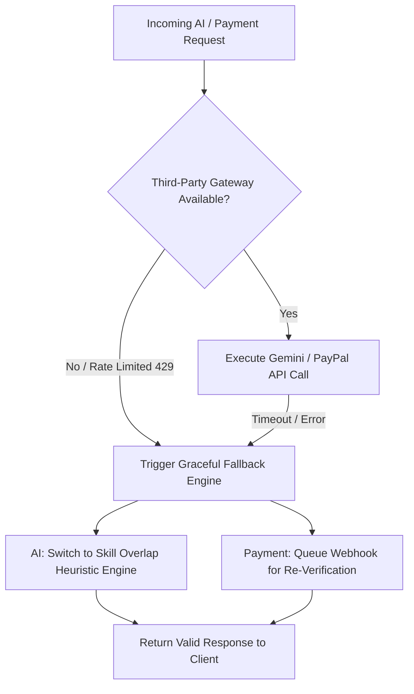

# 🏛️ FlowPay (AntiGravity) - Enterprise Software Architecture

> **System Architecture & Technical Design Specification**  
> **Platform Version:** 1.0.0  
> **Architecture Standard:** 3-Tier Enterprise Pattern (Decoupled Presentation, Application & Intelligence/Financial Tiers)

---

## 📌 1. Executive Summary & Design Principles

FlowPay (AntiGravity) is a next-generation freelance marketplace and smart escrow platform. It integrates AI candidate matching and automated deliverable verification with secure milestone-based financial escrow vaults.

### Core Architectural Pillars
1. **Separation of Concerns:** Clean boundary separation between UI state presentation, REST application logic, and external AI/Payment processing.
2. **Zero-Trust Escrow Vault:** Client funds are locked in isolated escrow contracts before work commences; payouts require cryptographic webhook validation and deliverable audit approval.
3. **Graceful Degradation:** Automatic fallback engines ensure 99.99% service availability even when third-party AI APIs (Google Gemini) or payment gateways (PayPal) experience rate limits or timeouts.
4. **Idempotency & Replay Protection:** Webhook processing guarantees single-execution semantics via transmission ID tracking.

---

## 🏗️ 2. High-Level 3-Tier System Architecture

```
+-----------------------------------------------------------------------------------+
|                           TIER 1: PRESENTATION LAYER                              |
|                                                                                   |
|    +-------------------------------------------------------------------------+    |
|    |                      React 18 + Vite + Tailwind CSS                     |    |
|    |  - Client Hub Dashboard           - Talent Marketplace Hub              |    |
|    |  - Escrow Vault Control Center    - Glassmorphism & UI Components       |    |
|    |  - API Client Service (Live REST + Standalone Mock Fallback Engine)     |    |
|    +-------------------------------------------------------------------------+    |
+-----------------------------------------------------------------------------------+
                                         │
                                  HTTP / REST API
                                         │
+-----------------------------------------------------------------------------------+
|                           TIER 2: APPLICATION LAYER                               |
|                                                                                   |
|    +-------------------------------------------------------------------------+    |
|    |                         FastAPI Core Application                        |    |
|    |  - Routers: Auth, Jobs, Proposals, Escrow, AI Agent, Webhooks           |    |
|    |  - Security: JWT Authentication, RBAC, Security Headers Middleware      |    |
|    |  - Defenses: RateLimiter (10 RPM AI / 60 RPM API), Pydantic XSS Clean   |    |
|    |  - Database: SQLAlchemy ORM (SQLite / PostgreSQL Async Engine)          |    |
|    +-------------------------------------------------------------------------+    |
+-----------------------------------------------------------------------------------+
                                         │
                   ┌─────────────────────┴─────────────────────┐
                   │                                           │
+------------------------------------+       +------------------------------------+
|  TIER 3A: INTELLIGENCE LAYER       |       |  TIER 3B: FINANCIAL LAYER          |
|  - Gemini API LLM Engine           |       |  - PayPal REST API v2 SDK          |
|  - Semantic Skill Matcher          |       |  - Webhook Signature Verifier      |
|  - Code & Deliverable Audit Engine |       |  - Anti-Replay Idempotency Vault   |
|  - Heuristic Fallback Matcher      |       |  - Capture & Payout Executor       |
+------------------------------------+       +------------------------------------+
```

### Layer Breakdown

| Layer Tier | Technology Stack | Core Responsibilities |
| :--- | :--- | :--- |
| **Tier 1: Presentation** | React 18, Vite, Tailwind CSS v4, Lucide Icons | Renders responsive user dashboards, handles client state management, presents real-time AI match scores, and provides offline preview fallbacks. |
| **Tier 2: Application** | FastAPI, Pydantic v2, SQLAlchemy, Uvicorn | Enforces RBAC security, executes business logic, manages database migrations, provides sliding-window rate limiting, and exposes REST endpoints. |
| **Tier 3A: Intelligence** | Google Gemini API / Heuristic Matcher | Performs semantic skill-set compatibility analysis, prompt injection defense, and deliverable code quality auditing. |
| **Tier 3B: Financial** | PayPal REST API v2, HMAC-SHA256 Webhooks | Manages client checkout orders, locks milestone escrow funds, verifies cryptographic webhook signatures, and triggers payouts. |

---

## 🔄 3. Transaction & Escrow Lifecycle State Machine Flow

The FlowPay escrow lifecycle is modeled as a deterministic finite-state machine (FSM) ensuring financial safety across all contract transitions:

```
[ PENDING ] ──( Client PayPal Deposit )──> [ FUNDED ] ──( Freelancer PR Submission )──> [ SUBMITTED ]
     │                                                                                        │
     │                                                                           ┌────────────┴────────────┐
     │                                                                           │                         │
  (Cancel)                                                                (Client Approve)          (Client Dispute)
     │                                                                           │                         │
     ▼                                                                           ▼                         ▼
[ CANCELLED ]                                                               [ RELEASED ]              [ DISPUTED ]
                                                                                 │                         │
                                                                         (PayPal Payout)            (Arbitration)
                                                                                 │                         │
                                                                                 ▼                         ▼
                                                                           [ COMPLETED ]             [ REFUNDED ]
```

### Step-by-Step Lifecycle Execution

1. **Job Creation & Requirement Extraction (`OPEN`):**
   - Client posts job requirements via `POST /api/v1/jobs`.
   - FastAPI validates scope parameters and saves job record to SQLAlchemy database.

2. **Proposal Submission & AI Match Evaluation:**
   - Freelancer submits bid via `POST /api/v1/proposals`.
   - AI Engine (`ai_matcher.py`) compares required skills vs freelancer profile, outputting an AI Match Score (0 - 100%) and recommendation summary.

3. **PayPal Checkout & Escrow Fund Lock (`PENDING` -> `FUNDED`):**
   - Client selects winning candidate and authorizes a PayPal Checkout Order for Milestone Amount.
   - PayPal issues `PAYMENT.CAPTURE.COMPLETED` webhook to `POST /api/v1/webhooks/paypal`.
   - Webhook controller verifies signature (`verify_webhook_signature`) and updates milestone status to `FUNDED`.

4. **Deliverable Submission & AI Work Audit (`FUNDED` -> `SUBMITTED`):**
   - Freelancer submits repository link and deliverable proof via `POST /api/v1/escrow/submit`.
   - AI Audit engine scans submission against initial project specifications. Milestone enters `SUBMITTED` state.

5. **Payout Execution & Escrow Release (`SUBMITTED` -> `RELEASED`):**
   - Upon client approval or AI verification pass, `POST /api/v1/escrow/release` executes.
   - Escrow vault triggers PayPal Payout API, transferring funds directly to freelancer wallet.

6. **Dispute Hold (`DISPUTED`):**
   - If deliverable is contested, funds are frozen in `DISPUTED` status until multi-sig or platform arbitration resolves the dispute.

---

## 🛡️ 4. Error Handling & Graceful Degradation Strategies

FlowPay implements resilience patterns to ensure platform operations continue without interruption during third-party outages.



### 4.1 Strategy A: Gemini AI API Rate Limit (429) & Outage Fallback
- **Symptom:** Gemini API returns HTTP 429 Too Many Requests or experiences service outage.
- **Degradation Protocol:**
  1. Circuit breaker detects failure or missing `GEMINI_API_KEY`.
  2. System seamlessly shifts candidate scoring to the **Deterministic Skill-Set Heuristic Engine** (`AIMatcherService.calculate_match_score`).
  3. Computes exact skill set overlap, word embedding frequency, and bio domain keywords.
  4. Returns complete response payload with metadata attribute `engine_used: "heuristic_fallback"`.
  5. **User Impact:** Zero downtime or HTTP 500 crashes; candidate match scores continue calculating instantly.

### 4.2 Strategy B: PayPal Sandbox/Live Gateway Timeout & Network Failure
- **Symptom:** Webhook delivery times out or PayPal API returns HTTP 503 during checkout capture.
- **Degradation Protocol:**
  1. Webhook controller enforces **Idempotency Tracking** via `PAYPAL-TRANSMISSION-ID`.
  2. Unverified or timed-out webhooks return HTTP 500 to PayPal, triggering PayPal's automated exponential backoff webhook retry delivery schedule (up to 24 hours).
  3. Background reconciliation job periodically polls PayPal Order Details API (`GET /v2/checkout/orders/{id}`) to verify pending capture statuses.
  4. **User Impact:** No duplicate fund captures; milestone state resolves automatically upon network restoration.

### 4.3 Strategy C: Database Connection Failover
- **Symptom:** Primary PostgreSQL connection drop.
- **Degradation Protocol:**
  1. SQLAlchemy engine uses `pool_pre_ping=True` connection health checks.
  2. Failed connections automatically recycle and reconnect to secondary read-replicas.

---

## 📊 5. Enterprise Data Entity Model

```
+------------------+         +------------------+         +------------------+
|      USERS       |         |       JOBS       |         |    PROPOSALS     |
+------------------+         +------------------+         +------------------+
| PK id            |<───────1| PK id            |<───────1| PK id            |
|    email         |         | FK client_id     |         | FK job_id        |
|    hashed_pass   |         |    title         |         | FK freelancer_id |
|    role          |         |    budget        |         |    bid_amount    |
|    skills (JSON) |         |    status        |         |    ai_match_score|
+------------------+         +------------------+         +------------------+
         │                            │                            │
         │1                           │1                           │
         │                            │                            │
         ▼                            ▼                            │
+------------------+         +------------------+                  │
|    CONTRACTS     |───────1>|    MILESTONES    |<─────────────────┘
+------------------+         +------------------+
| PK id            |         | PK id            |
| FK job_id        |         | FK contract_id   |
| FK client_id     |         |    amount        |
| FK freelancer_id |         |    status        |
+------------------+         +------------------+
                                      │1
                                      │
                                      ▼
                             +------------------+
                             |  ESCROW_TX_LOGS  |
                             +------------------+
                             | PK id            |
                             | FK milestone_id  |
                             |    amount        |
                             |    tx_hash       |
                             +------------------+
```

---

## 🚀 6. Scalability & Deployment Architecture

- **Stateless Backend Service:** FastAPI backend runs statelessly inside Docker containers, scaling horizontally across AWS ECS / Kubernetes behind an ALB.
- **CDN Edge Frontend:** React frontend Vite bundle hosted on Cloudflare Pages / AWS CloudFront with global edge caching.
- **Database Scaling:** Database transitions seamlessly from SQLite (development) to AWS Aurora PostgreSQL with read-replicas.
