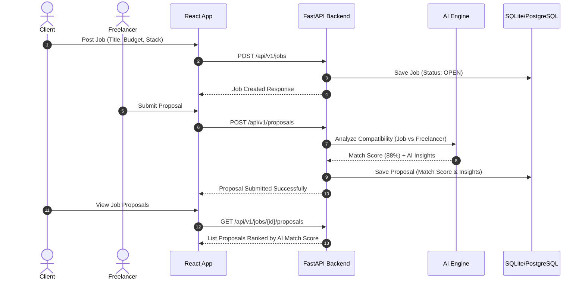
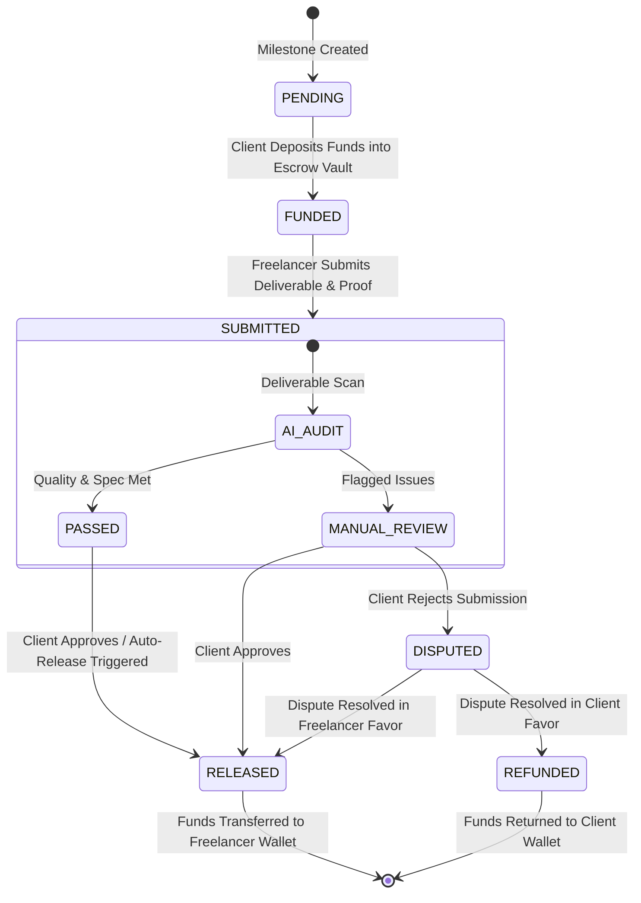
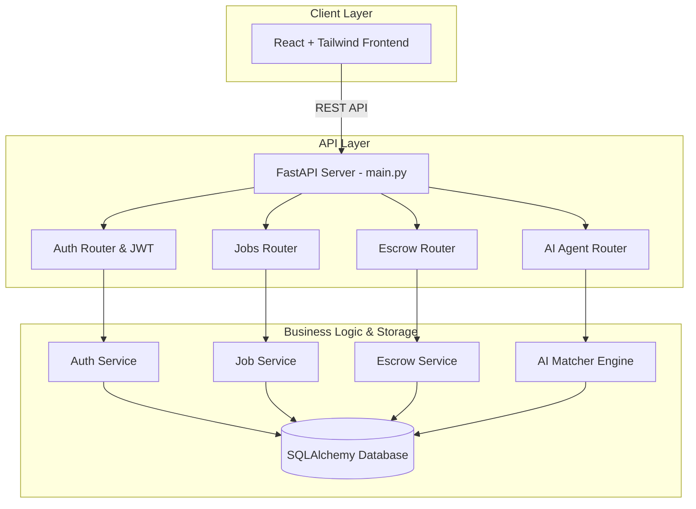

# FlowPay (AntiGravity) - Architecture Diagrams

This document contains visual diagrams illustrating the core workflows in FlowPay (AntiGravity).

---

## 1. AI Talent Matching & Proposal Flow

---

## 2. Automated Smart Escrow & Milestone Life Cycle

---

## 3. High-Level System Architecture

